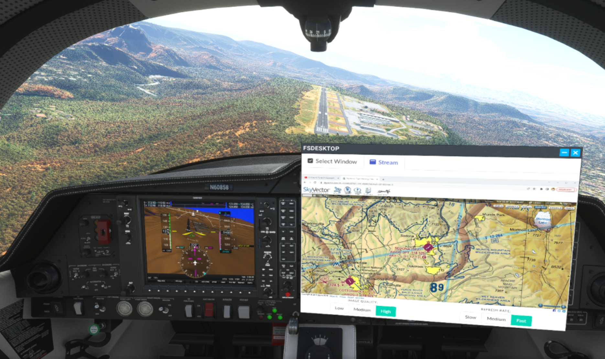
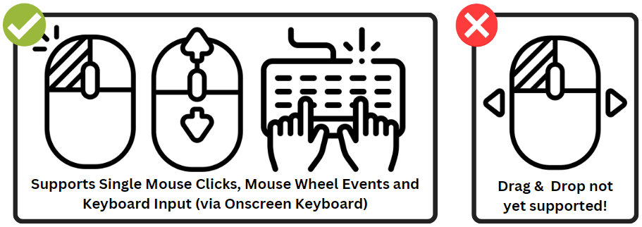
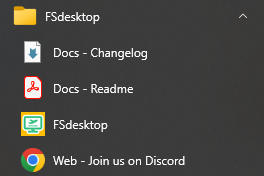
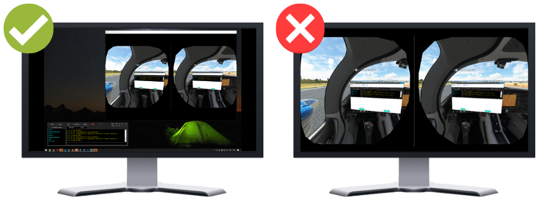
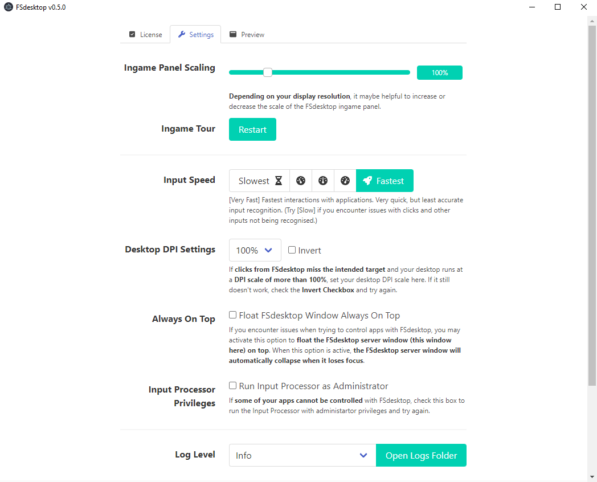

# FSdesktop: All Your Desktop Applications Inside Your Microsoft Flight Simulator VR Cockpit

This utility expansion for Microsoft Flight Simulator brings all your favorite desktop applications right into your VR cockpit.

FSdesktop can

-   enable you to watch your favorite streamers,
-   help you to follow along YouTube tutorials,
-   show you streamers out there your Twitch or YouTube chat
-   make those long distance flights a bit more entertaining by letting you stay in touch with your Discord communities
-   display your vPilot client
-   show you your LittleNavMap flight plans
-   ... and much, much more

right inside your Flight Simulator cockpit! This is is especially helpful for those of us who like to fly in VR (and thus not being able to look at a second screen).

If you like it, please let me know and share it with other VR pilots :-) Also, consider yourself invited to join me and the community on the [FSdesktop and FSdesktop Discord Server](https://discord.fsdesktop.com) at https://discord.fsdesktop.com

> **EARLY ACCESS DISCLAIMER:**
>
> Please note that FSdesktop is still in its very early development. Chances are that you will find missing features or encounter bugs.
>
> If you do, please check out the documentation to learn about known limitations and the feature roadmap in this document.
>
> Please report bugs and file feature requests via our [Community Discord](https://discord.fsdesktop.com).

---

# Table of Contents

1. [Screenshots](#screenshots)
2. [TL;DR](#tldr)
3. [Try FSdesktop For FREE](#try-fsdesktop-for-free)
4. [Support the Development and Go PRO](#support-the-development-and-go-pro)
5. [Getting Support](#getting-support)
6. [Features: Free vs. Pro](#features-free-vs-pro)
7. [Known Limitations and Roadmap](#known-limitations-and-roadmap)
8. [Components](#components)
9. [Installation](#installation)
10. [Usage](#usage)
11. [Troubleshooting](#troubleshooting)
12. [Attribution](#attribution)
13. [Releases and Downloads](#releases-and-downloads)
14. [Support Your Modders](#support-your-modders)

---

# Screenshots

_FSdesktop_

_vPilot in FSdesktop_

_Google Chrome in FSdesktop_

_Twitch Chat in FSdesktop_

_Toolbar Icon_

---

# TL;DR

The Mod consists of **TWO PARTS(!)**: a **main application** and an **ingame panel** that you need to install and run **BOTH**!

**Please take the time to at least read the Installation and Usage sections below!!!**

It's dead simple! But if you only install the panel to the community folder and ignore the server this mod won't run and may appear "broken" to you!

# Try FSdesktop For FREE

You can download FSdesktop and try it for free for 3 days. If you enjoy using FSdesktop, pleaser consider purchasing a license to support the development.

# Support the Development and Go PRO

If you enjoy using FSdesktop, you may decide to "go pro" at a Pay-What-You-Want-Price! It's really your call! You'll unlock all features of FSdesktop plus you support the mod's development. Also, you'll make a 3-year-old and a 7-year-old very, very happy, as I can buy them more ice cream :-)

# Getting Support

If you have any problems, questions or would like to get in touch and stay involved with an active community of like-minded VR enthusiasts, then don't miss out on yoining our community Discord over at [https://discord.fsdesktop.com](https://discord.fsdesktop.com)!

---

# Features (FREE vs. PRO)

Here's a quick feature breakdown of what features are included in both the FREE and the PRO version, and which features are exclusive for PRO version supporters...

<table id="free-pro-compare">
<tbody>
<tr>
<th></th>
<th>Free</th>
<th>PRO</th>
</tr>
<tr>
<td>All your desktop apps inside MSFS</td>
<td>✅
Yes</td>
<td>✅
Yes</td>
</tr>
<tr>
<td>Variable resolution to adjust for optimal performance</td>
<td>✅
Yes</td>
<td>✅
Yes</td>
</tr>
<tr>
<td>Variable refresh rate to adjust for optimal performance</td>
<td>✅
Yes</td>
<td>✅
Yes</td>
</tr>
<tr>
<td>Stream YouTube videos</td>
<td>✅
Yes</td>
<td>✅
Yes</td>
</tr>
<tr>
<td>Control your media player</td>
<td>✅
Yes</td>
<td>✅
Yes</td>
</tr>
<tr>
<td>Use vPilot</td>
<td>✅
Yes</td>
<td>✅
Yes</td>
</tr>
<tr>
<td>Follow your flight plan</td>
<td>✅
Yes</td>
<td>✅
Yes</td>
</tr>
<tr>
<td>Check your Emails</td>
<td>✅
Yes</td>
<td>✅
Yes</td>
</tr>
<tr>
<td>Follow your stream's chat</td>
<td>✅
Yes</td>
<td>✅
Yes</td>
</tr>
<tr>
<td>Configurable Hotkey</td>
<td>(✅)
Coming soon</td>
<td>(✅)
Coming soon</td>
</tr>
<tr>
<td>... and so much more!</td>
<td>✅
Yes</td>
<td>✅
Yes</td>
</tr>
<tr>
<td>Use forever</td>
<td>❌
3 days TRIAL period</td>
<td>✅
Yes</td>
</tr>
<tr>
<td>YOU actively support the ongoing development of FSdesktop, bringing Flight Simming in VR to the next level :-)</td>
<td>😎
Sure! Thanks for giving the mod a shot :-) Spread the word!</td>
<td>💚
YEAH! You rock!!!</td>
</tr>
<tr>
<td></td>
<td><a class="more-link" href="https://fsdesktop.com/try-free" target="_blank" rel="noopener">TRY FREE</a></td>
<td><a class="more-link" href="https://fsdesktop.com/buy-now/">BUY NOW</a></td>
</tr>
</tbody>
</table>

---

# Known Limitations and Roadmap

<table style="table-layout: fixed;">
<thead>
<tr>
<th style="width: 50%;">Limitation Description     </th>
<th style="width: 50%;">Status 💡 = (vague) idea how to approach and solve 🔥 = will be added/fixed soon ⏳ = will take time 🤔 = no clear approach / unlikely to be fixed soon</th>
</tr>
</thead>
<tbody>
<tr>
<td>Click recognition and forwarding should be more reliable</td>
<td>💡, 🔥, it appears that this mostly impacts Windows 11 users, I am currently inverstigating the issue</td>
</tr>
<tr>
<td>Currently only one window can be streamed at any given time; must go back to to window selector tab to switch</td>
<td>💡, 🔥</td>
</tr>
<tr>
<td>Missing keyboard support (physical and onboard)</td>
<td>💡, 🔥</td>
</tr>
<tr>
<td>Missing drag and drop support</td>
<td>💡, 🔥</td>
</tr>
<tr>
<td>Desktop DPI should be set to 100%</td>
<td>⏳</td>
</tr>
<tr>
<td>Windows/Applications must be at least partially visible</td>
<td>🤔, seems to be inherent to the Windows window management system</td>
</tr>
<tr>
<td>MSFS must run in windowed mode</td>
<td>🤔, seems to be inherent to the Windows window management system</td>
</tr>
<tr>
<td>Dropdown/Context menus and "subwindows" cannot be displayed and interacted with.</td>
<td>⏳, 🤔, needs some "engineering", not clear if this can be fixed</td>
</tr>
</tbody>
</table>

_Supported Input Methods_

---

# Components

The mod project consists of two components:

## MSFS Ingame Panel

The `panel` is the actual ingame panel that you see inside Microsoft Flight Simulator and acts as a client. It communicates with the...

## Main Application Server

The `main application` is a webserver and service provider for MSFS ingame panel. It renders the individual windows on your desktop and sends them to the client inside MSFS.

---

# Installation

There are two ways to install FSdesktop on your system: With a fully automated installer (recommended) or doing everything manually...

## Windows Installer (Recommended)

Download the Installer-Executable (`Install-FSdesktop-vX.Z.Y.exe`) from [the release section](https://github.com/Christian1984/fsdesktop/releases).

### Step 1: Launch the Installer

Once the download is finished, run the installer from the download directory. Administrator privileges are NOT required!!!

### Step 2: Pick an Application Home Directory

Select a directory where you want to install the FSdesktop main application. The suggested default location is in `%LOCALAPPDATA%\Programs\FSdesktop`, but you can change it to whatever you deem fit (like `C:\Tools\fsdesktop\` for example). Click `Next`!

_Select a Server Directory_

### Step 3: Select your MSFS Community Folder

Next, the FSdesktop Installer tries to locate your MSFS Community Folder, where the ingame panel must be installed to. The automatic location mechanism "should work" (TM) for both the Windows Store as well as the Steam versions of the game and the installer will tell you if it did succeed. Otherwise you will have to locate your Community Folder by hand. Then click `Next`!

IMPORTANT: Just pick the community folder! Do not add any subfolders. Otherwise the panel will NOT work!

_Locate your MSFS Community Folder_

### Step 4: Proceed

You should now see a summary of what the installer will copy to what folders. Click `Next` and the installation will begin. At the end, you will find everything you need to start FSdesktop in your windows start menu.

_FSdesktop Start Menu Items_

### Upgrading to a New Version

When upgrading to a new version, you should unistall the old one. You are free to try to simply "update" what you already have, but I don't recommend it. Old files may interfere with new ones and break the mod. Therefore, in case you encounter bugs after upgrading, properly uninstall FSdesktop and go for a fresh install!

Make sure to backup your license information, though, just to be save :-)

## Manual Installation (For those who don't trust the installer or need a "portable" version...)

Download the zip from [here](https://github.com/Christian1984/fsdesktop/releases).

### Manually Installing the Main Application Component

Place the contents of `application` folder somewhere convenient (like `C:\Tools\fsdesktop\`).

_Main Application Installation_

### Manually Installing the Client Component

Place the folder `christian1984-ingamepanel-fsdesktop` in your MSFS community folder (typically `C:\Users\[username]\AppData\Local\Packages\Microsoft.FlightSimulator_8wekyb3d8bbwe\LocalCache\Packages\Community`)

_Panel Installation_

When finished, your Community folder should look like this (though there may be more than one extension installed, obviously).

_Panel Installation - Done_

### Manually Upgrading to a New Version

Please remove **all files** from the server directory and `christian1984-ingamepanel-fsdesktop` from your community folder, before installing a new version. Do not "copy over". No excuses! Old files may interfere with new ones and break the mod. Just do it, but keep your license file :-)

---

# Usage

In order to launch FSdesktop, you need to do two things:

1. Launch the FSdesktop local server application by clicking the FSdesktop icon on your desktop or launch fsdesktop.exe from your command line and...
2. ... open the actual FSdesktop ingame panel inside MSFS.

## Start FSdesktop

-   Step 1: Run `fsdesktop.exe` by clicking either the appropriate desktop icon or selecting it from the start menu. This will bring up the FSdesktop core application's desktop window. FSdesktop will now wait for Microsoft Flight Simulator and connect to it.
-   Step 2: Start Microsoft Flight Simulator. You can do this by either clicking the appropriate icon on your desktop.
-   Step 3: Open up the ingame panel once inside the sim (like you would do with other ingame panels like the ATC or weather panel etc.)
    > When you open the FSdesktop ingame panel for the very first time, you will be greated by an interactive tour that will guide you through the basics of how the application works. Please, please, pretty please: Take the time to follow along and do not skip the tour. It has some very important information in it!
-   Step 4: Place the FSdesktop Panel conveniently in your VR space
-   Step 5: Click one of the desktop windows that FSdesktop has found to see them in VR.

> Please Note:
>
> To get the best out of FSdesktop, please make sure that you run Microsoft Flight Simulator windowed, NOT in full screen.
>
> 
>
> _Run Flight Simulator in Fullscreen Mode_
>
> Also, you want to make sure that the window you are about to stream into your VR space is at least party visible.
>
> 
>
> _The Application Should be Partly Visible_

## Activate Your License

If you have purchased a license for FSdesktop, you can activate it by simply entering your email address (the one you used to order) and your serial number in the appropriate fields of the FSdesktop application window. Then click "Checkout FSdesktop License".

If the checkout was successful, your credentials will be stored and, going forward, the license will be checked out automatically when FSdesktop launches.

_How to Activate Your License_

## Adjust The Core Application Seetings

_Core Application Settings_

In the FSdesktop core application's settings dialog you'll find the following options:

-   **Ingame Panel Scaling**: Depending on your screen resolution, the size of your MSFS window and other factors (such as newly released Sim Updates 🙄) you may consider changing your FSdesktop ingame panel's scaling. For most users 100% will work just fine and if you are happy with the appearance of FSdesktop, there is no reason to touch this slider. If you are not, you can use this slider to increase or decrease the ingame panels resolution, making the appearance of the app's UI elements smaller or larger and also affecting the resolution of the streamed content.

-   **Input Speed**: Optimize the input speed depending on your particular system and setup. For Windows 11, it is recommended to set the input speed to slow. This allows Windows 11 a little bit more time to switch between applications and finally process your input. The option "slowest" should only be used as a last resort. If you encounter issues with input processing, play around with these settings until you find a setting that works well for you.

-   **Input Processor Privileges**: If you run into issues where you find that a particular app cannot be controlled with FSdesktop, you can use this checkbox to restart the input processor (the software piece that actually takes your mouse clicks and sends them to the target application) with administrator privileges. Note that this will trigger the Windows UAC asking you for permission to start the input processor with elevated privileges. You may always revoke granted privileges by simply unchecking this box.

    > PLEASE NOTE: This feature is considered experimental. It **may** help with controlling other applications, particularly those that, themselves, run with elevated privileges. My own tests showed improvements with some applications, but your milage may vary. Either way, please provide tons of feedback over at https://discord.fsdesktop.com! 💪
    >
    > Also, note that I typically advice users to grant third party software (mine included) as little privileges as possible. Please use this feature only as a last resort!\_

-   **Ingame Tour**: Click this button to restart the FSdesktop ingame panel tour.

-   **Log Level**: Configure the log level. Set to "Debug" if you want to submit a log for me to analyze, otherwise let it sit on "Warning".

## How To Bring Up The FSdesktop Panel in VR

In order to open up the actual FSdesktop panel inside MSFS, first enter VR mode. Next, hit the `[TAB]` key to bring up the ingame toolbar and click the FSdesktop icon to bring up the ingame panel.

_How to open the ingame panel_

## Adjust the Ingame Panel Settings

_Ingame Panel Settings_

When actively streaming a window into Flight Simulator, FSdesktop will show a little "burger menu" on the top right of the ingame panel. Click it to reveal the ingame panel settings dialog with the following settings:

-   **Image Quality**: Set the image quality of the streamed window to low, medium or high, depending on your particular needs. High will show the streamed window very crisp and with a high resolution, but streaming larger windows with this setting may impact Flight Simulator's performance. Use medium or low if you want to prioritize performance over quality.
-   **Refresh Rate**: Set the frame rate of the streamed window to low, medium or high. High will update the image of the streamed window very frequently, i.e. result in a high panel framerate, but streaming larger windows with this setting may impact Flight Simulator's performance. Use medium or low if you want to prioritize performance over quality.
-   **Background**: Set the background of the streamed window to either black or white.

---

# Advanced Usage: Command Line Arguments

The FSdesktop server can be started with several commandline arguments to further customize its behaviour. In general, all you need to do is add them behind your "fsdesktop.exe" shortcut.

-   `--log [level]`: Set log level and enable logging to file. `[level]` can be any of `debug | info | warn | error | off` (defaults to `off`). Use together with flag `--verbose` to also log to `stdout`. This will override/adjust the settings previously set through the GUI. Also, if you encounter issues during FSdesktop startup, running `fsdesktop.exe --log debug` is the way to go!
-   `--resettour`: Reset the tour(s).

_Log Level Shortcut_

# Troubleshooting

## "I can stream my appication with FSdesktop, but I cannot interact with it. What is wrong?"

> Please make sure that your setup complies with the following prerequisites:
>
> 1. Make sure MSFS runs in **windowed** mode
> 2. Make sure that the window you are going to use is at **least partly visible**
> 3. Ensure that your desktop runs at **100% DPI**
>
> Finally, it appears that Windows 11 users experience issues with controlling there applications when in VR. This issue is under investigation.

## "I cannot see the FSdesktop ingame panel inside MSFS. What is wrong?"

> There are typically two reasons why this can happen:
>
> 1. First, make sure that you have opened up MSFS's ingame toolbar. In 2D mode, that happens automatically when you hover your mouse over the chevron on the very top of the window. In VR mode you need to press the `[TAB]` key to bring up this toolbar! Now, double-check whether the FSdesktop icon appears on that toolbar or not. If it does, then click it. Issue solved :-)
> 2. Second, if the icon does not appear, it is very likely that the ingame panel was installed to the wrong directory. To identify the proper community folder please read the next section and then come back... Got your community folder location? Great! Now uninstall FSdesktop and run the installer again. When prompted to enter your community folder location, enter the community folder path that you have just identified. Restart MSFS and the panel should appear.

## "I cannot find my community folder. Help!!!"

> Here's how to localize your active community folder with 100% certainty:
>
> 1. Start MSFS and wait for the main menu to be loaded.
> 2. Now click Options > General
> 3. Open the "Developers"-settings-page, which is located at the bottom of the list on the left
> 4. Turn on "Developers Mode"
> 5. A new menu bar will appear on the top of your screen. Select Tools > Virtual File System
> 6. Now you can locate the community folder under "Watched Bases"

## "Everything inside the FSdesktop panel appears stretched!"

> Please make sure that the main MSFS window has roughly a 16:9 aspect ratio as shown below:
>
> 
>
> _Flight Simulator Window Aspect Ratio_

## "I have skipped the tour and now I would like to watch it again. How can I accomplish that?"

> Easy. Open the FSdesktop main application and navigate to the settings tab. From here, click the "Restart Tour" button. Then close and reopen the FSdesktop ingame panel. The tour should now start.

---

# Attribution

This project was inspired by [bymaximus/msfs2020-toolbar-window-template](https://github.com/bymaximus/msfs2020-toolbar-window-template). Great work! Thanks for sharing your work with us!!!

### Icons

-   Icons provided by [FontAwesome](https://fontawesome.com/license/free).
-   Tour icons provided by:
    -   [Left click icons created by Smashicons - Flaticon](https://www.flaticon.com/free-icons/left-click)
    -   [Scroll icons created by Smashicons - Flaticon](https://www.flaticon.com/free-icons/scroll)
    -   [Typing icons created by Freepik - Flaticon](https://www.flaticon.com/free-icons/typing)

---

# Releases and Downloads

Program zips and installers of FSdesktop FREE are released and uploaded [here](https://github.com/Christian1984/fsdesktop/releases).

---

# Support Your Modders :-)

If you enjoy this project, please consider buying me a coffee and/or donating to the guys I mentioned in the Attribution section above. It allows us to keep developing addons and mods like these ones and making them available for free. Any amount is welcome! Thank you.

